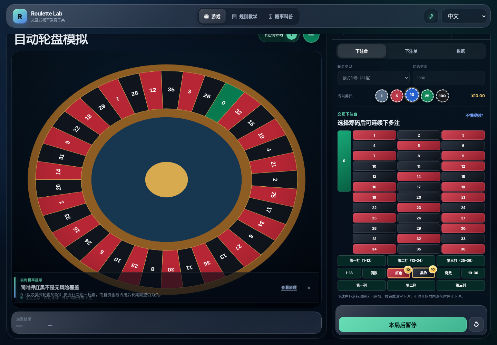
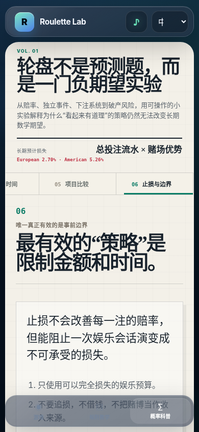

<div align="center">

# Roulette Lab v6

### 多语言 3D 轮盘与概率教育实验室  
### A multilingual 3D roulette and probability-learning lab


**中文：** 在浏览器中体验自动轮盘、多重下注和批量模拟，并通过互动实验理解赌场优势、独立事件、赌徒谬误、追损和常见下注系统。  
**English:** Experience an automatic roulette table, multiple simultaneous bets, and batch simulations while learning about house edge, independent events, the gambler’s fallacy, loss chasing, and common betting systems.

[](https://dashboard.render.com/blueprint/new?repo=https://github.com/Mudkipython/roulette)

</div>

> [!IMPORTANT]
> 本项目只用于概率教育，不连接真钱、账户、支付系统或博彩服务。  
> This project is for probability education only. It has no real-money, account, payment, or gambling-service integration.

## Preview / 项目预览


<table>
<tr>
<td width="50%"></td>
<td width="50%"></td>
</tr>
<tr>
<td align="center"><b>游戏内概率提示 / Contextual learning coach</b></td>
<td align="center"><b>移动端科普章节 / Mobile learning chapters</b></td>
</tr>
</table>

## What changed in v6 / v6 更新

- 修复概率科普侧边栏错误返回游戏的问题；章节路由现在使用 `#learn/<topic>`。
- 将科普页改为编辑式科普刊物布局，减少圆角卡片和模板化“AI 面板”感。
- 新增六个可切换章节：赔率、连开、下注系统、流水、项目比较、止损边界。
- 新增互动策略实验：固定下注、马丁格尔、斐波那契、达朗贝尔、拉布谢尔、冷热号。
- 新增连开实验、流水计算器和娱乐边界规划工具。
- 游戏中实时识别并解释：反向追连、顺势追连、输后加码、红黑对冲、流水过高和双零风险。
- 中英法三语内容同步更新。

- Fixed the learning-sidebar bug that returned users to the game; chapter routes now use `#learn/<topic>`.
- Rebuilt the learning area as an editorial science publication rather than a grid of generic rounded cards.
- Added six switchable chapters: payouts, streaks, betting systems, turnover, game comparison, and limits.
- Added interactive demonstrations for flat betting, Martingale, Fibonacci, D’Alembert, Labouchère, and hot/cold-number systems.
- Added a streak experiment, turnover calculator, and entertainment-boundary worksheet.
- Added contextual in-game explanations for opposite-colour chasing, hot-hand chasing, bet escalation, red/black hedging, high turnover, and double-zero risk.
- Updated Chinese, English, and French content.

## Core experience / 核心体验

| Area | Description |
|---|---|
| **Automatic roulette** | Rotor and ball animation with an open-betting phase, “no more bets,” descent, pocket settlement, and automatic next round. |
| **Multiple bets** | Place several straight and outside bets; undo the last chip, remove one line, clear all, or repeat the previous round. |
| **Contextual coach** | Educational prompts appear when the player exhibits recognizable probability misconceptions or risky staking patterns. |
| **Interactive learning** | Strategy laboratories expose how bet size and bankroll requirements change while the underlying expectation does not. |
| **Statistics** | Compare bankroll, turnover, actual P/L, expected P/L, and observed return; run 100–10,000 round batches. |
| **Responsive app** | Desktop top navigation and inspector layout; mobile bottom navigation and horizontal chapter rail. |

## Three views / 三个页面

### Play / 游戏

A 3D automatic table with chip selection, interactive bet board, multi-bet slip, live results, batch simulation, and contextual probability coaching.

### Rules / 规则教学

A four-step tutorial covering the betting layout, open-betting period, betting close, pocket result, settlement, and common payouts.

### Learn / 概率科普

An editorial, chapter-based explorable article covering:

1. Fair payouts and house edge
2. Independent spins, streaks, and “due” outcomes
3. Six common betting systems
4. Turnover, time, and expected loss
5. Typical house-edge comparisons
6. Budget, stop-loss, and time boundaries

## Mathematical transparency / 数学透明性

European single-zero roulette has 37 equally likely pockets. Most standard bets have a house edge of:

```text
1 / 37 ≈ 2.70%
```

American double-zero roulette has 38 pockets and a typical house edge of:

```text
2 / 38 ≈ 5.26%
```

The central learning relationship is:

```text
Long-run expected loss ≈ total amount wagered × house edge
长期预计损失 ≈ 累计投注流水 × 赌场优势
```

> [!NOTE]
> Outcomes are sampled locally with the Web Crypto API. The 3D motion is a physics-inspired educational sequence that resolves to the sampled pocket; it is not a trajectory-prediction model or engineering-grade rigid-body simulation.

## Design direction / 设计方向

- Translucent glass is limited mainly to navigation and controls.
- Learning content uses a warm editorial paper layer, serif display typography, rules, ledgers, margin notes, and interactive figures.
- Chapters replace one long scrolling article and preserve the current route.
- The interface avoids default bento grids and repeated equal-weight cards.
- Reduced-motion preferences and a 2D fallback are supported.

This project is not affiliated with or endorsed by Apple.

## Technology stack / 技术栈

- Three.js `0.185.1`
- Vite `8.1.5`
- Vanilla HTML, CSS, and JavaScript
- Canvas 2D fallback and charting
- Web Crypto API
- Render Static Site Blueprint

## Local development / 本地运行

Requirements:

- Node.js `22.x`
- npm `10+`

```bash
git clone https://github.com/Mudkipython/roulette.git
cd roulette
npm ci --no-audit --no-fund
npm run dev
```

Production build:

```bash
npm run build
npm run preview
```

The production output is written to `dist/`.

## Deploy to Render / 部署到 Render

Use the Blueprint button above, or configure a Static Site manually:

```text
Branch: main
Root Directory: [leave blank]
Build Command: npm ci --no-audit --no-fund && npm run build
Publish Directory: dist
```

No database or application secret is required.

## Scope and disclaimer / 项目边界与免责声明

Roulette Lab explains probability and negative expected value. It is not a real-money game, a gambling strategy, a prediction product, or a replica of a particular commercial roulette machine.

短期赢钱不代表存在可持续盈利策略。赌博可能造成财务和心理伤害。不要借钱赌博、追逐损失，或将赌博视为收入来源。

Short-term wins do not prove a sustainable profit strategy. Gambling can cause financial and psychological harm. Do not borrow to gamble, chase losses, or treat gambling as income.
