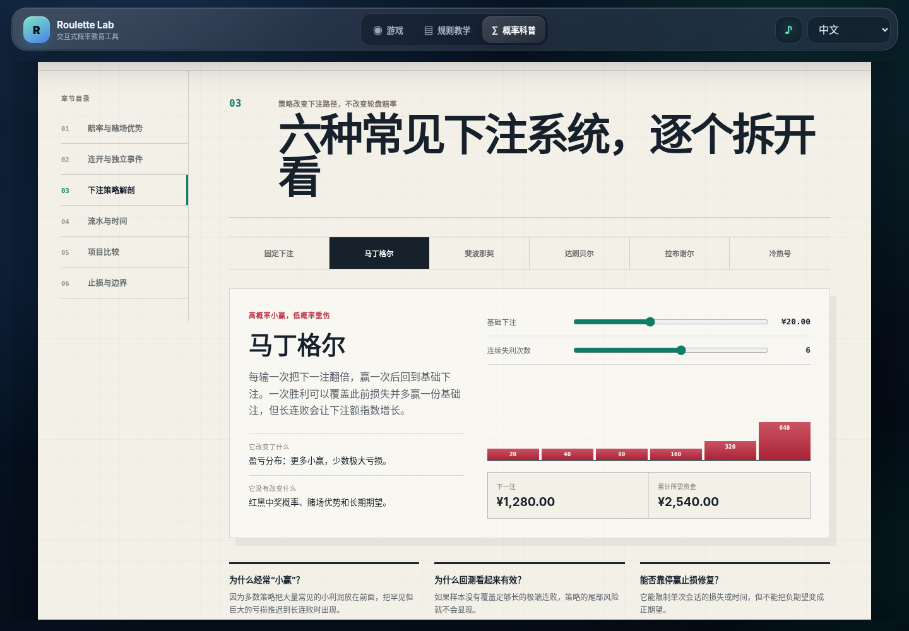

<div align="center">

# Roulette Lab v8

### 3D 轮盘、概率实验与负数学期望科普网站


[在线体验](https://roulette-gf95.onrender.com/#play) ·
[规则教学](https://roulette-gf95.onrender.com/#rules) ·
[概率科普](https://roulette-gf95.onrender.com/#learn/edge)

[](https://dashboard.render.com/blueprint/new?repo=https://github.com/Mudkipython/roulette)

</div>

> [!IMPORTANT]
> Roulette Lab 仅用于概率教育，不连接真钱、用户账户、支付系统或博彩服务。所有模拟都在浏览器本地运行。

## 项目简介

Roulette Lab 是一个面向概率教育的多语言互动网站。它把轮盘游戏、规则教学和统计科普放在同一个应用中，让用户亲自观察：

- 短期赢钱与长期负数学期望可以同时存在；
- 不同下注的波动程度不同，但多数标准下注具有相同的赌场优势；
- 真正推动预计损失的是累计投注流水，而不只是初始资金；
- 连续出现红色或黑色不会改变下一局的结构概率；
- 马丁格尔、斐波那契和冷热号等系统改变的是下注路径，而不是期望值；
- 轮盘类型、下注速度和单局金额会共同影响长期损失。

## 页面预览


<table>
<tr>
<td width="50%"></td>
<td width="50%"></td>
</tr>
<tr>
<td align="center"><strong>暂停、重置、视角与声音设置</strong></td>
<td align="center"><strong>互动下注策略实验室</strong></td>
</tr>
</table>

## v8 新增内容

### 可调节的 3D 视角

- 拖动轮盘区域可以在受限范围内环绕观察；
- 鼠标滚轮或触控板可以放大、缩小；
- 手机和平板支持单指旋转和双指缩放；
- 镜头距离、俯仰角和水平旋转角均设有边界，避免进入桌面内部或出现眩晕式乱转；
- 游戏画面和暂停菜单都提供“一键恢复默认视角”。

### 现场感声音系统

声音全部由 Web Audio API 在浏览器本地生成，不下载外部音乐：

- 小球沿轨道滚动、撞击挡板、进入号码槽和开奖的音效；
- 低音量房间底噪与远处人群氛围；
- 偶发的远处筹码与玻璃碰撞声；
- 原创、无旋律复制的轻柔休闲乐垫；
- 音效与环境声可分别开关，并可调节总音量。

由于浏览器的自动播放限制，环境声会在用户第一次点击或按键后启动。

### 暂停页面

点击“本局后暂停”，当前局开奖完成后会打开暂停页面。暂停页面集中提供：

- 继续自动开局；
- 重置资金、下注、历史和统计；
- 恢复默认镜头；
- 开关小球与开奖音效；
- 开关赌场环境声；
- 调整总音量。

重置只修改浏览器内存中的模拟状态，不刷新页面，也不会上传数据。

### 字体与布局优化

- 操作界面使用系统 UI 字体栈，兼顾 macOS、iOS、Windows 与中文显示；
- 标题使用更有层次的 display 字体栈；
- 概率文章使用适合中英文长文阅读的衬线字体栈；
- 减少浏览器默认字体和过度卡片化的观感；
- 调整标题字重、字距、面板间距和移动端暂停页面结构；
- 保留受 Liquid Glass 启发的导航与控制层，但正文与游戏主体保持高对比度。

## 核心功能

| 模块 | 说明 |
|---|---|
| **物理轮盘模拟** | 固定步长求解球速衰减、离轨、向内滑动、挡板碰撞、号码隔片碰撞和稳定落袋。 |
| **自动开局流程** | 自动发球后开放下注；小球离开外轨时停止下注；开奖后自动进入下一局。 |
| **多重下注** | 可同时押多个单号及外围项目，并支持撤销、逐项删除、全部清空和重复上一局。 |
| **欧式与美式轮盘** | 支持欧式单零 37 格和美式双零 38 格。 |
| **统计面板** | 显示资金、累计流水、实际盈亏、理论盈亏与实际返还率。 |
| **批量模拟** | 使用上一局下注组合快速模拟 100、1,000 或 10,000 局。 |
| **实时概率教练** | 识别追连、追损、红黑对冲、高流水和双零风险，并在游戏中解释。 |
| **规则教学** | 四步讲解下注台、开放下注、停止下注和开奖结算。 |
| **策略实验室** | 互动展示固定下注、马丁格尔、斐波那契、达朗贝尔、拉布谢尔和冷热号。 |
| **多语言** | 支持 🇨🇳 中文、🇬🇧 English 和 🇫🇷 Français。 |
| **响应式设计** | 桌面端顶部导航与右侧控制区；移动端底部导航和自适应暂停页面。 |

## 一局如何运行

1. 号码盘开始旋转，小球进入外沿轨道；
2. 外轨阶段开放下注，可继续增加、撤销或清空下注；
3. 小球速度下降并离开外轨时，下注立即锁定；
4. 小球沿斜面向内运动，与挡板和号码隔片发生碰撞；
5. 小球相对旋转号码盘逐渐稳定，最终号码由物理状态决定；
6. 所有下注逐项结算，界面显示实际盈亏和理论期望；
7. 结果展示结束后自动准备下一局。

## 物理模型说明

3D 模式使用针对轴对称轮盘编写的固定时间步长求解器，而不是预设贝塞尔曲线或强制对准号码：

- 以 240 Hz 固定子步长更新运动状态；
- 模拟外轨角速度衰减和临界离轨；
- 模拟倾斜定子上的径向重力分量与摩擦；
- 对挡板和号码隔片使用连续碰撞检测和冲量响应；
- 使用低恢复系数，避免程序化的高弹跳；
- 最终结果由小球相对于旋转转子的稳定角度决定。

WebGL 不可用时，网站会切换到 2D 均匀随机回退模式。该模型用于概率科普和网页体验，不是针对某一台商业轮盘标定的工业数字孪生，也不能用于预测真实轮盘结果。

## 数学透明性

欧式单零轮盘有 37 个等概率结果。多数标准下注的赌场优势为：

```text
1 / 37 ≈ 2.70%
```

美式双零轮盘有 38 个结果，典型赌场优势为：

```text
2 / 38 ≈ 5.26%
```

项目最核心的关系是：

```text
长期预计损失 ≈ 累计投注流水 × 赌场优势
```

## 技术栈

- Three.js `0.185.1`
- Vite `8.1.5`
- 原生 HTML、CSS 与 JavaScript
- 自定义固定步长轮盘物理求解器
- OrbitControls 受限镜头控制
- Web Audio API 本地合成音效与环境声
- Canvas 2D 回退与统计图表
- Web Crypto API
- Render Static Site Blueprint

## 项目结构

```text
roulette/
├── index.html
├── styles.css
├── app.js
├── src/
│   ├── roulette3d.js
│   └── roulettePhysics.js
├── tests/
│   └── physics-regression.mjs
├── docs/
├── package.json
├── package-lock.json
└── render.yaml
```

## 本地运行

环境要求：

- Node.js `22.x`
- npm `10+`

```bash
git clone https://github.com/Mudkipython/roulette.git
cd roulette
npm ci --no-audit --no-fund
npm run dev
```

生产构建与预览：

```bash
npm run build
npm run preview
```

物理回归：

```bash
npm run test:physics
```

生产文件输出到 `dist/`。

## 部署到 Render

可以点击页面顶部的 Deploy to Render 按钮，或者手动创建 Static Site：

```text
Branch: main
Root Directory: 留空
Build Command: npm ci --no-audit --no-fund && npm run build
Publish Directory: dist
```

不需要数据库、后端服务或应用密钥。

## 隐私、无障碍与安全

- 游戏状态、声音和模拟均在用户浏览器本地运行；
- 不收集个人数据，不创建账户，不处理支付；
- 关键操作使用可通过键盘访问的 DOM 控件；
- 提供 ARIA 状态提示和跳转链接；
- 支持 `prefers-reduced-motion`；
- WebGL 不可用时提供 2D 回退；
- 环境声为本地合成，不连接外部音频服务。

## 项目边界与免责声明

Roulette Lab 用于解释概率、赌场优势和负数学期望。它不是真钱游戏、赌博策略、号码预测产品，也不是某一款商业自动轮盘的完整复刻。

短期赢钱不代表存在可持续盈利策略。赌博可能造成财务与心理伤害。请勿借钱赌博、追逐损失，或将赌博视为收入来源。

---

<div align="center">

# Roulette Lab v8

### A 3D roulette, probability experiment, and negative-expected-value learning website

[Live demo](https://roulette-gf95.onrender.com/#play) ·
[Rules](https://roulette-gf95.onrender.com/#rules) ·
[Probability lab](https://roulette-gf95.onrender.com/#learn/edge)

</div>

> [!IMPORTANT]
> Roulette Lab is for probability education only. It has no real-money, account, payment, or gambling-service integration. All simulations run locally in the browser.

## Overview

Roulette Lab is a multilingual interactive probability application that combines a playable roulette table, a rules tutorial, and explorable statistical education. It helps users see that:

- short-term wins can coexist with negative long-run expectation;
- bets can have different variance while sharing the same house edge;
- expected loss is driven by cumulative wagering turnover, not only starting bankroll;
- previous colours and numbers do not make an outcome “due”;
- Martingale, Fibonacci, and hot/cold systems change the staking path rather than expected value;
- wheel type, round speed, and stake size jointly determine long-run loss.

## What is new in v8

### Adjustable 3D camera

- Drag the roulette scene to orbit within a controlled viewing range.
- Use the mouse wheel or trackpad to zoom.
- Phones and tablets support one-finger orbit and two-finger pinch zoom.
- Distance, polar angle, and horizontal rotation are constrained to prevent clipping, upside-down views, or motion-sickness-style camera movement.
- Reset the camera from either the scene toolbar or pause menu.

### Locally generated casino soundscape

Audio is generated with the Web Audio API and does not download external music:

- ball rolling, deflector, pocket, and result effects;
- low-level room tone and distant crowd texture;
- occasional distant chip and glass details;
- an original non-derivative lounge pad;
- independent effect and ambience toggles plus master volume.

Because browsers restrict autoplay, ambience begins after the first click or key interaction.

### Pause surface

Selecting “Pause after round” opens a dedicated pause surface after settlement. It provides:

- resume automatic rounds;
- reset bankroll, bets, history, and statistics;
- restore the default camera;
- toggle effects;
- toggle casino ambience;
- adjust master volume.

Resetting only clears in-memory browser state. It does not reload the page or upload data.

### Typography and layout refinement

- A system UI font stack supports macOS, iOS, Windows, and Chinese text.
- Display headings use a more deliberate title stack.
- Long educational articles use a bilingual-friendly serif stack.
- Typography weight, tracking, panel rhythm, and mobile pause layout were refined.
- Liquid Glass-inspired translucency remains concentrated in navigation and controls, while the playfield and learning content retain stable contrast.

## Core features

| Area | Description |
|---|---|
| **Physical roulette simulation** | Fixed-step integration for angular decay, rim exit, inward motion, deflector contact, separator contact, and pocket settling. |
| **Automatic round lifecycle** | Launch, open betting, no more bets, descent, settlement, and automatic next round. |
| **Multiple bets** | Combine straight and outside bets with undo, per-line removal, clear-all, and repeat-last-round controls. |
| **European and American wheels** | European single-zero 37-pocket and American double-zero 38-pocket modes. |
| **Statistics** | Bankroll, turnover, actual P/L, expected P/L, and observed return. |
| **Batch simulation** | Simulate 100, 1,000, or 10,000 rounds using the previous bet slip. |
| **Contextual probability coach** | Explains streak chasing, loss chasing, red/black hedging, high turnover, and double-zero risk during play. |
| **Rules tutorial** | Four-step explanation of the table, open betting, betting close, and settlement. |
| **Strategy laboratory** | Flat betting, Martingale, Fibonacci, D’Alembert, Labouchère, and hot/cold systems. |
| **Languages** | 🇨🇳 Chinese, 🇬🇧 English, and 🇫🇷 French. |
| **Responsive design** | Desktop top navigation and inspector; mobile bottom navigation and adaptive pause sheet. |

## Round lifecycle

1. The rotor spins and the ball enters the outer track.
2. Betting remains open while the ball circles the rim.
3. Bets lock when the ball loses rim support and begins moving inward.
4. The ball travels across the inclined stator and contacts deflectors and pocket separators.
5. The result is determined by the ball’s final stable angle relative to the rotating rotor.
6. All wagers settle independently and the interface compares actual P/L with expected value.
7. The next round prepares automatically after the result hold.

## Physics model

The 3D mode uses a fixed-step solver designed for an axisymmetric roulette table rather than scripted curves or target-number alignment:

- 240 Hz fixed substeps;
- angular-speed decay and critical rim exit;
- radial gravity and friction on the inclined stator;
- continuous collision checks and impulse response for deflectors and pocket separators;
- low restitution to avoid artificial high bounces;
- final result determined from the stable relative rotor angle.

When WebGL is unavailable, the application switches to a uniform 2D random fallback. The model is intended for browser education and is not an industrial digital twin calibrated to a particular commercial wheel. It must not be used to predict real roulette outcomes.

## Mathematical transparency

European single-zero roulette has 37 equally likely outcomes. Most standard bets have a house edge of:

```text
1 / 37 ≈ 2.70%
```

American double-zero roulette has 38 outcomes and a typical house edge of:

```text
2 / 38 ≈ 5.26%
```

The central relationship is:

```text
Long-run expected loss ≈ total amount wagered × house edge
```

## Technology stack

- Three.js `0.185.1`
- Vite `8.1.5`
- Vanilla HTML, CSS, and JavaScript
- Custom fixed-step roulette physics solver
- Constrained OrbitControls camera
- Web Audio API procedural effects and ambience
- Canvas 2D fallback and charting
- Web Crypto API
- Render Static Site Blueprint

## Local development

Requirements:

- Node.js `22.x`
- npm `10+`

```bash
git clone https://github.com/Mudkipython/roulette.git
cd roulette
npm ci --no-audit --no-fund
npm run dev
```

Production build and preview:

```bash
npm run build
npm run preview
```

Physics regression:

```bash
npm run test:physics
```

The production output is written to `dist/`.

## Deploy to Render

Use the Blueprint button above, or create a Static Site manually:

```text
Branch: main
Root Directory: [leave blank]
Build Command: npm ci --no-audit --no-fund && npm run build
Publish Directory: dist
```

No database, backend process, or application secret is required.

## Privacy, accessibility, and safety

- Game state, audio, and simulations run locally in the browser.
- No personal data, accounts, or payments are collected.
- Important actions use keyboard-accessible DOM controls.
- ARIA status messages and a skip link are included.
- Reduced-motion preferences are respected.
- A 2D fallback is provided when WebGL is unavailable.
- Ambience is synthesized locally and does not contact an external audio service.

## Scope and disclaimer

Roulette Lab explains probability, house edge, and negative expected value. It is not a real-money game, a gambling strategy, a prediction product, or a complete replica of a specific commercial automatic roulette machine.

Short-term wins do not prove a sustainable profit strategy. Gambling can cause financial and psychological harm. Do not borrow to gamble, chase losses, or treat gambling as income.
