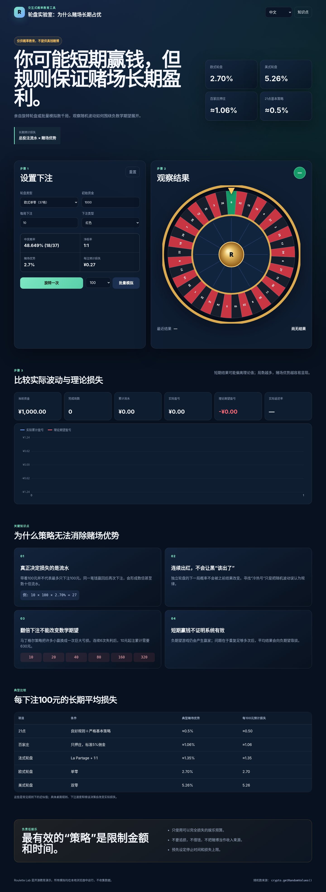

# Roulette Lab — Why the House Wins

A multilingual (简体中文 / English / Français) educational roulette simulator. It demonstrates:

- European single-zero vs. American double-zero roulette
- Straight, even-money, dozen, and column bets
- Exact win probability, payout, house edge, and expected loss
- Single-spin animation and 100 / 1,000 / 10,000-spin simulations
- Bankroll, total turnover, observed return, and expected-loss chart
- Gambler's fallacy, Martingale risk, variance, and responsible-play notes



The app is fully static. It has no backend, no accounts, no payments, and no analytics. Random outcomes are generated locally with `crypto.getRandomValues()`.

## Run locally

From this directory:

```bash
python3 -m http.server 8080
```

Then open `http://localhost:8080`.

## Deploy to Render

### Option A — Blueprint

1. Create a GitHub repository and upload all files in this folder.
2. Confirm `render.yaml` is in the repository root.
3. Open:

```text
https://dashboard.render.com/blueprint/new?repo=https://github.com/<USERNAME>/<REPOSITORY>
```

4. Select the repository and apply the Blueprint.

Render will create a free static site using the included configuration.

### Option B — Render dashboard

1. In Render, choose **New → Static Site**.
2. Connect the GitHub repository.
3. Use these settings:
   - Build command: `echo "Static educational site ready"`
   - Publish directory: `.`
4. Deploy.

## Files

- `index.html` — semantic page structure and educational content
- `styles.css` — responsive visual design
- `app.js` — wheel rendering, secure RNG, settlement logic, simulation, charts, and translations
- `render.yaml` — Render Blueprint

## Mathematical model

For standard roulette bets:

- European wheel house edge: `1 / 37 ≈ 2.7027%`
- American wheel house edge: `2 / 38 ≈ 5.2632%`
- Expected loss: `total wagered × house edge`

Short-run outcomes can be positive, but the expectation remains negative.

## License

MIT. Educational use encouraged. Do not present the simulator as a method for making money from gambling.
